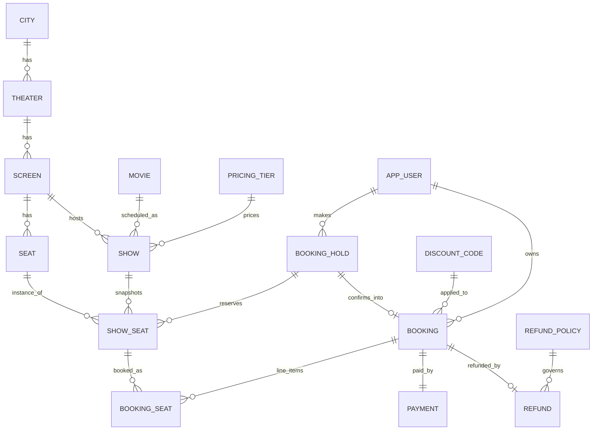

# Movie Ticket Booking System — Low-Level Design

## 1. Problem Restatement

Build a movie ticket booking backend (Spring Boot) supporting: multiple cities → theaters →
screens → shows, seat-level booking with time-bound holds, tiered pricing + discount codes,
payment, booking confirmation, and refund-on-cancellation under configurable policies.
Concurrent booking attempts on the same seat must never double-allocate. Confirmation /
reminder notifications must not block the booking request.

Roles: **ADMIN** (manage cities, theaters, shows, seat layouts, pricing tiers, refund policies) and
**CUSTOMER** (browse, hold/book/cancel seats, view booking history).

## 2. Key Assumptions (also mirrored in README)

1. Single deployable Spring Boot service, single relational database (H2, file-backed) — no
   microservices, no external message broker. "Async" = in-process `@Async` + bounded
   `ThreadPoolTaskExecutor`, not a distributed queue (explicitly out of scope).
2. Auth is username/password (BCrypt) + Spring Security **Basic Auth** with two roles. No
   OAuth/SSO/JWT — "basic RBAC" is explicitly what's asked for.
3. A **seat layout** is defined per **Screen** (not per Show). When a Show is created for a
   Screen, the system snapshots the screen's seats into per-show `ShowSeat` rows — this is what
   actually gets locked/held/booked, so changing a screen's layout later never corrupts an
   already-scheduled show.
4. **Hold TTL** defaults to 5 minutes, configurable via `booking.hold-ttl-seconds`. A background
   sweeper releases expired holds every 30s; holds are also lazily treated as expired the moment
   any subsequent operation touches them (belt-and-suspenders, no stale seats visible to users).
5. Pricing = `PricingTier.basePrice(seatType) * (1 + weekendSurcharge% if show falls on Sat/Sun)`,
   then discount code applied (percentage or flat, floor at 0).
6. Discount codes have a global usage cap enforced atomically under lock (no over-redemption
   under concurrent use).
7. Refund % is resolved from an ordered list of `RefundPolicy` rows by "hours until showtime"
   (e.g. ≥24h → 100%, ≥2h → 50%, else 0%) — admin-configurable, first matching rule wins.
8. Payment is **simulated** synchronously in-process (`PaymentService`) — no real gateway
   integration, since that's an external dependency not in scope. It's a seam
   (`PaymentGateway` interface) so a real integration could be swapped in later.
9. "Delivered without blocking the booking flow" = booking/cancel transactions commit and
   return to the caller before notification dispatch runs, via
   `ApplicationEventPublisher` → `@Async` listener → bounded executor.

## 3. Domain Model

Core tables: `city, theater, screen, seat, movie, pricing_tier, show, show_seat, booking_hold,
booking, booking_seat, payment, discount_code, refund_policy, refund, notification, app_user`.

`show_seat` is the concurrency-critical table: `UNIQUE(show_id, seat_id)`, status ∈
`{AVAILABLE, HELD, BOOKED}`, nullable `hold_id`, `@Version` column for optimistic-lock defense
in depth on top of the pessimistic locking described below.

## 4. Concurrency Design (the core correctness requirement)

**Goal:** N concurrent requests for the same seat on the same show → exactly one succeeds, rest
get a clean `409 SEAT_UNAVAILABLE`, no lost updates, no deadlocks.

**Mechanism — pessimistic row locks, not optimistic retry-storms:**

1. `POST /api/shows/{showId}/hold {seatIds:[...]}` opens one DB transaction.
2. Load the requested `ShowSeat` rows with `SELECT ... FOR UPDATE`, **ordered by seat_id ASC**
   (fixed lock-acquisition order across all callers ⇒ no deadlocks between two holds racing on
   overlapping seat sets).
3. For each locked row: eligible iff `status == AVAILABLE`, or `status == HELD` **and**
   `bookingHold.expiresAt < now` (treat as expired even if the sweeper hasn't run yet).
4. **All-or-nothing**: if any requested seat is not eligible, abort the whole hold (no partial
   holds) and return which seats were unavailable.
5. On success: create `BookingHold(status=ACTIVE, expiresAt=now+ttl)`, set each locked
   `ShowSeat.status=HELD`, `holdId=<new>`. Commit releases the row locks.
6. `POST /api/holds/{holdId}/confirm`: re-lock the same `ShowSeat` rows by `holdId` (`FOR UPDATE`),
   verify hold is `ACTIVE` and unexpired and owned by the caller, lock+validate the discount code
   row if present (atomic usage-count increment), run payment, then flip rows to `BOOKED` and
   hold to `CONFIRMED` in the same transaction as `Booking`/`BookingSeat`/`Payment` creation.
7. Expiry sweeper (`@Scheduled(fixedRate=30s)`): finds `ACTIVE` holds past `expiresAt`, locks
   their seats `FOR UPDATE`, flips seats back to `AVAILABLE`, hold to `EXPIRED`.
8. Defense in depth: `@Version` optimistic column on `ShowSeat` — if a code path ever mutates a
   row outside the locking discipline above, the transaction fails fast with
   `OptimisticLockException` instead of silently corrupting state.

**Proof sketch for "no double allocation":** the only writers of `ShowSeat.status` are the three
flows above, and all three acquire `SELECT ... FOR UPDATE` on the exact row before reading or
writing its status, inside a single transaction that also does the status flip. Two transactions
can never both observe `AVAILABLE` for the same row and both proceed to `HELD`/`BOOKED` — the
second one blocks until the first commits, then re-reads the now-changed status and is rejected.

This is validated by an integration test that fires `N` threads at the same seat concurrently and
asserts exactly one `200`.

## 5. API Surface

**Admin** (`ROLE_ADMIN`): CRUD for `cities`, `theaters`, `screens` (+ bulk seat layout),
`movies`, `pricing-tiers`, `discount-codes`, `refund-policies`; `POST /shows` (auto-generates
`show_seat` rows from the screen layout), `GET/PUT /shows/{id}`.

**Customer** (`ROLE_CUSTOMER`, some endpoints public for browse):
- `GET /api/shows?cityId=&movieId=&date=`
- `GET /api/shows/{id}/seats` — seat map with live status
- `POST /api/shows/{id}/hold` `{seatIds:[...]}` → `{holdId, expiresAt, unavailableSeats?}`
- `DELETE /api/holds/{holdId}` — release early
- `POST /api/holds/{holdId}/confirm` `{discountCode?, paymentMethod}` → `Booking`
- `GET /api/bookings`, `GET /api/bookings/{id}`
- `POST /api/bookings/{id}/cancel` → triggers refund calc

**Auth:** `POST /api/auth/register` (customer self-signup), then HTTP Basic on every call.

## 6. Async Notifications

`BookingConfirmedEvent` / `BookingCancelledEvent` published via `ApplicationEventPublisher`
inside the same transaction (published on commit, `TransactionPhase.AFTER_COMMIT`). A
`@Async("notificationExecutor")` listener persists a `Notification` row and "sends" it
(logged — no real email/SMS gateway, out of scope). `notificationExecutor` is a bounded
`ThreadPoolTaskExecutor` so a burst of confirmations can't exhaust threads. A
`ReminderScheduler` runs periodically, finds confirmed bookings for shows starting within the
next 2h that haven't been reminded, and dispatches the same way.

## 7. Security

Spring Security filter chain, stateless Basic Auth, `PasswordEncoder=BCrypt`. `AppUser` in DB
with `role ∈ {ADMIN, CUSTOMER}`. Method-level `@PreAuthorize` on admin endpoints;
ownership checks in service layer for customer resources (a customer can only see/cancel
their own bookings — enforced in code, not just by role).

## 8. Testing Strategy

- **Unit**: `PricingService` (tier × weekend surcharge), `DiscountService` (percent/flat, cap
  enforcement), `RefundPolicyResolver` (boundary hours), `HoldExpiry` logic — pure logic, Mockito
  for repo boundaries.
- **Integration** (`@SpringBootTest`, real H2, real transactions): full hold→confirm→cancel
  happy path; RBAC 403s; hold-expiry sweep actually frees seats; **concurrent seat contention
  test** (the headline test — N threads, 1 seat, exactly 1 winner); discount-code usage cap
  under concurrent redemption.

## 9. Tech Stack

Java 17, Spring Boot 3, Spring Data JPA + Hibernate, Spring Security (Basic Auth), H2
(file-mode, zero external setup for the reviewer), Flyway (versioned schema), Lombok,
Bean Validation, JUnit 5 + Mockito + AssertJ. No Docker/CI — matches "out of scope".
